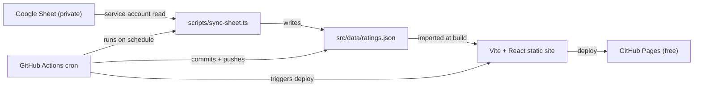

# OF Ratings — Phased Implementation Plan

## Architecture (one-line summary)

A static SPA (Vite + React + TS + MUI, mirroring your `resume` repo) that reads a JSON snapshot of the sheet that is committed to the repo. A local Node/TS sync script (`scripts/sync-sheet.ts`) pulls from Google Sheets via a service account and writes that JSON — either run manually or on a cron schedule via GitHub Actions. No runtime backend, no hosting cost, no browser-side credentials.



## Decisions already locked

- **Stack:** React 19 + Vite + TypeScript + MUI (matches `resume` repo conventions).
- **Data source:** Google Sheet, read via `googleapis` SDK using a **service account** shared as Viewer.
- **Data flow:** sheet → committed `ratings.json` → static build. No live API calls from the browser.
- **Per-location coordinates:** `lat` + `lng` columns in the sheet. `google_maps_url` for the "Open in Maps" link. Optional: `address`, `date_visited`. The sync script tolerates missing `lat`/`lng` and flags those rows.
- **Map:** Leaflet + OpenStreetMap via `react-leaflet` (Phase 3). Free, no key, mobile-friendly.
- **Hosting:** GitHub Pages, deployed via GitHub Actions (free). Custom domain can point at it via DNS later.
- **Sync automation:** GitHub Actions cron workflow runs `npm run sync` on a schedule, commits the updated `ratings.json`, and triggers a redeploy. Service account credentials stored as a GitHub Secret.

## Sheet schema

| column            | required | notes                                          |
|-------------------|----------|------------------------------------------------|
| `rater`           | yes      | "Brad" or "Kyle" (capitalized, consistent)     |
| `location_name`   | yes      | display name                                   |
| `rating`          | yes      | numeric (e.g. 1–10)                            |
| `notes`           | no       | free text                                      |
| `lat`             | yes*     | decimal, e.g. `41.8781`                        |
| `lng`             | yes*     | decimal, e.g. `-87.6298`                       |
| `google_maps_url` | no       | full Google Maps share URL                     |
| `address`         | no       | full street address, display only              |
| `city`            | no       | extracted from geocoder, useful for filtering  |
| `state`           | no       | extracted from geocoder, useful for filtering  |
| `date_visited`    | no       | ISO date, used for sorting later               |

\* If missing, Phase 1's sync script flags the row and an optional helper offers to auto-fill via OpenStreetMap's free Nominatim geocoder. You can also fill them by right-clicking in Google Maps (the first menu item is the coordinate pair, click to copy).

## Repo layout (target)

```
OF_Ratings/
  package.json
  vite.config.ts
  tsconfig*.json
  .gitignore                     # ignores secrets/, .env, node_modules
  README.md
  PLAN.md                        # this file
  .github/
    workflows/
      deploy.yml                 # Phase 0 — build + deploy on push to main
      sync.yml                   # Phase 1 — cron: sync sheet + commit + push
  secrets/
    service-account.json         # gitignored
  scripts/
    sync-sheet.ts                # Phase 1 — pulls sheet -> ratings.json
    geocode-missing.ts           # Phase 1 helper — optional
  src/
    main.tsx
    App.tsx
    data/
      ratings.json               # committed snapshot
      meta.json                  # { lastSyncedAt, sourceSheetId }
    types/
      rating.ts                  # Rating type, shared
    pages/
      ListPage.tsx               # Phase 1 + 2
      MapPage.tsx                # Phase 3
    components/
      RatingCard.tsx
      SearchBar.tsx              # Phase 2
      RaterFilter.tsx            # Phase 2
      RatingsMap.tsx             # Phase 3
```

## Phase 0 — "Hello world" website (live on the public internet)

**Goal:** Stand up the actual website with a deliberate hello-world landing page, deployed to a free public URL. No data, no Google APIs, nothing fancy — just prove the full pipeline (scaffold → build → deploy → load in a browser) works before we add complexity.

### Phase 0 implementation tasks

1. **Scaffold the project** in `/Users/patrick/Documents/Projects/OF_Ratings`:
   - `npm create vite@latest . -- --template react-ts`
   - `npm install`
   - Install MUI: `npm install @mui/material @emotion/react @emotion/styled @mui/icons-material`
2. **`.gitignore`** entries (added on top of Vite's defaults): `secrets/`, `.env`, `.env.*`.
3. **Hello-world landing page** in `src/App.tsx`:
   - MUI `<CssBaseline />` and a small light/dark theme.
   - Top `AppBar` with title "OF Ratings".
   - Centered `Container` with:
     - `<Typography variant="h2">Hello, old fashioneds.</Typography>`
     - Tagline: `Brad and Kyle's ratings, mapped.`
     - Two MUI `Chip`s: `Brad` and `Kyle`.
     - A small `Typography variant="caption"` footer: `Phase 0 • coming soon`.
   - Page is responsive: looks good on a phone screen at 375px wide and on desktop.
4. **Vite base path** for GitHub Pages: in `vite.config.ts`, set `base: "/OF_Ratings/"` (so assets resolve correctly when served from `https://thequietlooppm.github.io/OF_Ratings/`). When a custom domain is wired up later, change this to `"/"`.
5. **Deploy to GitHub Pages via GitHub Actions:**
   - Create `.github/workflows/deploy.yml`: triggered on push to `main`, runs `npm ci` + `npm run build`, deploys `dist/` using `actions/upload-pages-artifact` + `actions/deploy-pages`.
   - In repo settings → Pages: set source to **GitHub Actions** (not a branch).
   - Push to `main` to trigger the first deploy.
6. **README updates:** quick "how to run / how to deploy" section.

### Why GitHub Actions over the `gh-pages` npm package

The original approach used `npm run deploy` + the `gh-pages` package. GitHub Actions is better here because:
- The cron sync (Phase 1) commits to `main` and needs to trigger an automatic redeploy — Actions handles this naturally without extra wiring.
- No `gh-pages` branch to manage; deployment state lives in GitHub's Pages API.
- `workflow_dispatch` lets you trigger a manual deploy from the GitHub UI without touching the terminal.

### Phase 0 acceptance / test plan

- `npm run dev` opens locally and renders the hello-world page (title, tagline, Brad + Kyle chips).
- `npm run build` succeeds with zero TS errors.
- Pushing to `main` triggers the deploy workflow; visiting `https://thequietlooppm.github.io/OF_Ratings/` shows the page.
- Loading that URL on your phone renders correctly (no horizontal scroll, text legible, chips visible).

### Phase 0 commit checkpoint

- `chore(phase0): scaffold Vite + React + TS + MUI`
- `feat(phase0): hello-world landing page`
- `chore(phase0): GitHub Actions deploy workflow`

**Stop here, confirm the live URL works on desktop and mobile, then move to Phase 1.**

---

## Phase 1 — Sheet sync end-to-end

**Goal:** Prove that the sync script can read the sheet and that the site can render the data. Output is a plain list view (deliberately ugly) — the win is data flowing end-to-end, including the automated cron sync.

### Phase 1 prerequisites (you do these before writing any code)

> ✅ All prerequisites below are already complete as of Phase 0 work.

1. ✅ **Unified Google Sheet created** — `WebPage` tab in sheet `1vSMuoIyETtCjNhlH0BZFxfJhl4ZwsJDCFqY7qOlnfMA`. Headers: `rater`, `rating`, `notes`, `googleMapsUrl`, `locationName`, `address`, `lat`, `lng`, `dateVisited`, `state`, `city`. All rows populated via `npm run lookup`.

### Phase 1 Google Cloud setup (one-time, manual)

> ✅ All Google Cloud steps below are already complete.

2. ✅ Google Cloud project `of-ratings` created, **Google Sheets API** enabled.
3. ✅ Service account `of-ratings-sync@of-ratings.iam.gserviceaccount.com` created, JSON key at `secrets/service-account.json` (gitignored).
4. ✅ Sheet shared with service account as **Editor**.
5. ✅ `.env` created with `SHEET_ID` and `SHEET_TAB`.

### Phase 1 GitHub configuration (one-time, manual — do this before the cron workflow runs)

6. Go to **repo Settings → Secrets and variables → Actions**.
7. Under **Secrets**, click "New repository secret":
   - Name: `GOOGLE_SERVICE_ACCOUNT_JSON`
   - Value: paste the entire contents of `secrets/service-account.json` (the full JSON)
8. Under **Variables**, click "New repository variable" twice:
   - Name: `SHEET_ID`, Value: `1vSMuoIyETtCjNhlH0BZFxfJhl4ZwsJDCFqY7qOlnfMA`
   - Name: `SHEET_TAB`, Value: `WebPage`
9. GitHub Pages source is already set to **GitHub Actions** (done in Phase 0) — no change needed.

### Phase 1 implementation tasks

1. Add deps: `googleapis`, `dotenv`, `tsx` (devDep).
2. Define `src/types/rating.ts`:
   ```ts
   export type Rater = "Brad" | "Kyle";
   export type Rating = {
     rater: Rater;
     locationName: string;
     rating: number;
     notes?: string;
     lat?: number;
     lng?: number;
     googleMapsUrl?: string;
     address?: string;
     city?: string;
     state?: string;
     dateVisited?: string;
     hasCoords: boolean;
   };
   ```
3. Implement `scripts/sync-sheet.ts`:
   - Loads `.env`, authenticates with the service account. Reads credentials from `secrets/service-account.json` in local dev; falls back to `GOOGLE_SERVICE_ACCOUNT_JSON` env var (the full JSON as a string) when running in CI.
   - Maps header row to `Rating` fields (case-insensitive, trimmed). Validates that `rater` is `"Brad"` or `"Kyle"` and fails loudly on anything else.
   - Writes `src/data/ratings.json` (sorted by `rater`, then `locationName`) and `src/data/meta.json` with `{ lastSyncedAt, sourceSheetId, rowCount, missingCoordsCount }`.
   - Logs a summary table to stdout, including any rows missing `lat`/`lng`.
4. Optional helper `scripts/geocode-missing.ts` that calls Nominatim (with a polite User-Agent + ≥1 req/sec) for rows missing coordinates and prints suggested values to paste into the sheet. (Free, no key.)
5. Add npm scripts:
   ```json
   "scripts": {
     "sync": "tsx scripts/sync-sheet.ts",
     "sync:geocode": "tsx scripts/geocode-missing.ts"
   }
   ```
6. **Add GitHub Actions cron sync** at `.github/workflows/sync.yml`:
   - Triggers: `schedule` (`0 6 * * *` — daily at 6am UTC) + `workflow_dispatch` for manual runs.
   - Steps: checkout → setup Node 20 → `npm ci` → `npm run sync` → commit `src/data/` if changed → push to `main` (which triggers the deploy workflow).
   - GitHub Secrets needed: `GOOGLE_SERVICE_ACCOUNT_JSON` (paste full JSON content). Repo variables: `SHEET_ID`, `SHEET_TAB`.
7. Update `App.tsx` to import `ratings.json` and render a simple MUI `<List>` of all rows (rater, location, rating, notes, "missing coordinates" chip when applicable). Show `meta.lastSyncedAt` in the AppBar.

### Phase 1 acceptance / test plan

- `npm run sync` succeeds locally, prints row counts, writes `ratings.json` and `meta.json`.
- `git status` shows only the JSON files changed (no committed secret).
- `npm run dev` lists every row, with rater + name + rating visible.
- A row added to the sheet appears in the UI after re-running `npm run sync`.
- Rows with missing `lat`/`lng` are clearly flagged but still listed.
- Trigger the cron workflow manually via `workflow_dispatch` — it syncs, commits, and the live site updates.

### Phase 1 commit checkpoint

- `feat(phase1): sheets sync script + ratings.json snapshot`
- `feat(phase1): render snapshot as basic list view`
- `chore(phase1): GitHub Actions cron sync workflow`
- (optional) `feat(phase1): nominatim geocode helper`

**Stop here, push, manually verify on the deployed site before starting Phase 2.**

---

## Phase 2 — Search and filter

**Goal:** Find places already rated, and by whom.

### Phase 2 implementation tasks

1. Promote the list view into `pages/ListPage.tsx`. Extract `components/RatingCard.tsx` (MUI `Card` with rater chip, rating, notes, "Open in Maps" link if `googleMapsUrl` exists).
2. `components/SearchBar.tsx`: MUI `TextField` with debounced (~150ms) input. Filters by case-insensitive substring match against `locationName`, `notes`, and `address`.
3. `components/RaterFilter.tsx`: MUI `ToggleButtonGroup` with `All` / `Brad` / `Kyle` / `Both rated`. ("Both rated" groups by `locationName`, normalized lowercase + trimmed, and shows places with entries from both raters.)
4. URL-sync the filters via `useSearchParams` so a search is shareable.
5. Empty-state component when no results match.
6. Group toggle: "Group by location" — collapses multiple ratings of the same place into one card showing both raters' scores side by side.

### Phase 2 acceptance / test plan

- Typing a substring filters the list live.
- Switching rater filter narrows results correctly; counts shown next to each toggle.
- "Both rated" mode only shows locations with one Brad entry and one Kyle entry.
- Refreshing the page preserves the search/filter state from the URL.
- `npm run build` succeeds with no TS errors.

### Phase 2 commit checkpoint

- `feat(phase2): search bar + rater filter`
- `feat(phase2): group by location toggle`
- `feat(phase2): url-synced search state`

**Stop here, push, verify before starting Phase 3.**

---

## Phase 3 — Interactive map

**Goal:** Drop every rated location on a map; tapping a marker shows the rating(s).

### Phase 3 implementation tasks

1. Add deps: `leaflet`, `react-leaflet`, `@changey/react-leaflet-markercluster` (use this over `react-leaflet-markercluster` — better react-leaflet v4 compatibility), and `@types/leaflet`.
2. `components/RatingsMap.tsx`:
   - `MapContainer` with OSM tile layer (`https://tile.openstreetmap.org/{z}/{x}/{y}.png`, attribution required).
   - Skip rows where `hasCoords` is false.
   - Marker cluster group around `lat`/`lng`.
   - Marker popup = mini `RatingCard` (rater chip + rating + notes + Open in Maps link).
   - Auto-fit bounds to all markers on first render; fall back to a default center/zoom when all markers are filtered out (don't crash on an empty set).
   - Respect existing search/filter state from Phase 2.
3. `pages/MapPage.tsx` and a top-level MUI `Tabs`/router that lets you switch between **List** and **Map** views.
4. Mobile pass: full-bleed map on small screens, search bar collapses into a pull-down sheet, popups are touch-friendly.
5. Custom marker color per rater (Brad blue, Kyle red); both-rated locations get a third color.

### Phase 3 acceptance / test plan

- Map renders on desktop and mobile web (test in Chrome devtools mobile emulation + on your phone).
- Pinch-zoom and pan are smooth on a real phone.
- Cluster expands when zooming in; popups fully visible inside viewport.
- Search/filter state from Phase 2 reduces the markers shown.
- Locations missing coordinates show in a "Not on map" callout below the map (link to the list view).

### Phase 3 commit checkpoint

- `feat(phase3): leaflet map page with markers + popups`
- `feat(phase3): clustering + per-rater marker colors`
- `feat(phase3): list/map view toggle + mobile polish`

---

## Out of scope (intentional)

- Live Sheets API from the browser (the snapshot model replaces this).
- Authentication/login on the site (data is read-only public).
- Paid Google APIs (Geocoding/Places). Free Nominatim covers any auto-geocoding need.

## Risks and how this plan handles them

- **Missing `lat`/`lng`:** Phase 1 surfaces it in the UI and provides a free geocoder helper, so Phase 3 isn't blocked.
- **Sheet schema drift:** sync script reads headers by name, not position; new columns are ignored, missing required columns fail loudly.
- **Service account key leak:** `secrets/` is gitignored from Phase 0; key is never imported by anything in `src/`. In CI the key is injected via GitHub Secret as an env var and never written to disk.
- **Name matching for "Both rated":** locations are matched by `locationName` normalized to lowercase + trimmed. Minor spelling differences ("The Violet Hour" vs "Violet Hour") will create separate entries rather than grouping — fix by keeping naming consistent in the sheet.
- **Each phase is independently shippable.** If you stop after Phase 1, you still have a working catalog of ratings with automated daily syncs.
